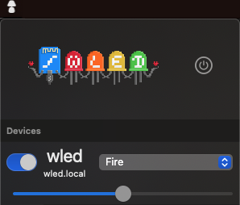

[View on the App Store](https://apps.apple.com/us/app/wled-native/id6446207239)

# WLED-Native-iOS
A brand new app for iPhone and iPad rewritten from scratch for discovering and controlling your WLED devices easily!
This aims to replace the previous WLED app [found here](https://github.com/Aircoookie/WLED-App).

### Features
- Automatic device detection (mDNS)
- All lights are accessible from one list
- Custom names
- Hide or delete devices
- Light and dark mode

## About WLED

This application is made to connect and control devices using [WLED](https://github.com/Aircoookie/WLED).  
Read the full documentation of [WLED here!](https://kno.wled.ge/)

## Disclaimer

This project is not an official Google project. It is not supported by
Google and Google specifically disclaims all warranties as to its quality,
merchantability, or fitness for a particular purpose.

# WLED–OSX

An MacOS menu bar to control [WLED](https://github.com/Aircoookie/WLED).

## Features

- Power on / off controll
- Brightness controll
- Selection of defined presed
- Automatic device detection in local network

## Ideas / To Implement

- [ ] Set timer / sunrise …
- [ ] Open website for detailed configuration
- [ ] Open link to WLED-documentation
- [ ] Manage devices, store devices, rename devices
- [ ] Refresh devices 
- [ ] Improve button position

## Thanks

To [Christophe Gagnier](https://github.com/Moustachauve) ([WLED-Native-iOS](https://github.com/Moustachauve/WLED-Native-iOS)) for inspiration and showing how networking can be done for WLED in Swift.
